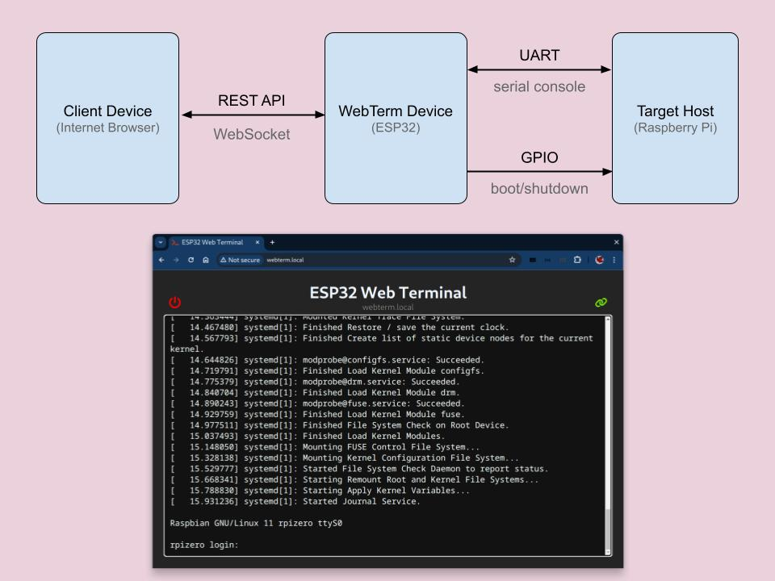
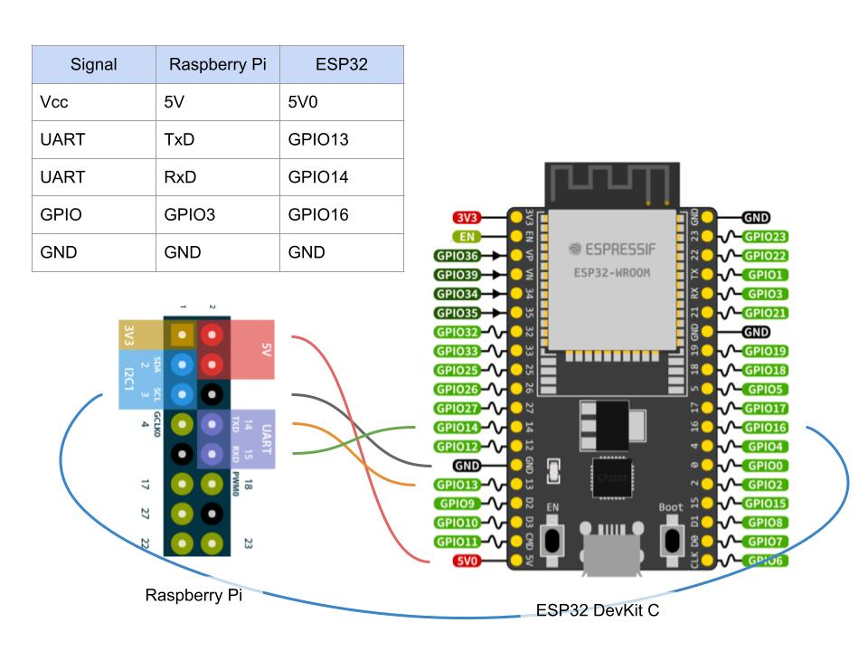

# ESP32 Web Serial Terimal for Raspberry Pi

This project turns an [ESP32 DevkitC](https://www.espressif.com/en/products/devkits/esp32-devkitc/) to a web terminal to Raspberry Pi via UART connection.



## Prerequisites

- [ESP-IDF v5 or higher](https://docs.espressif.com/projects/esp-idf/en/stable/esp32/get-started/index.html)
- [Nodejs v18 or higher](https://github.com/nodesource/distributions)

## ESP32 Development Environment

Add mDNS component

```
idf.py add-dependency "espressif/mdns^1.2.5"
```

Run menuconfig

```
idf.py menuconfig
```

Find `Web Terminal` menu and change values if necessary:

- mDNS Host Name
- Website deploy mode (semihosting VFS / external SD card / SPI Flash)
- Web source directory name
- WiFi SSID and passkey
- WiFi Scan auth mode threshold

In case you have chosen SPI Flash as Website deploy mode (default),
you have to set custom partitiion table. Confirm the content of `partitions.csv`.
Then select

```
Partition Table > Partition Table > Custom partion table CSV
```

## Web Page Build

Build web page:

```
cd www/frontend
npm install
npm run build
```

## Deploy

Flash the device

```
idf.py build flash
```

Hook up the device to the Raspberry Pi. You need to connect following signals:

| signal | Raspberry Pi J8 | ESP32       |
| ------ | --------------- | ----------- |
| UART   | GPIO14(TxD)     | GPIO13(RxD) |
| UART   | GPIO15(RxD)     | GPIO14(TxD) |
| WAKE   | GPIO3(SCL)      | GPIO16      |
| 5V     | 5V              | 5V          |
| GND    | GND             | GND         |



Note that the ESP32 device gets the power from the Raspberry pi. So you don't need to separate power for device.

Be sure that the serial terminal of the Raspberry Pi is enabled [in the config.txt file.](https://www.raspberrypi.com/documentation/computers/configuration.html#part5.6)

```
enable_uart=1
```

After powered up, open up a browser and navigate to `webterm.local` or the mDNS host address of your choice.

# Limitations

- Current implementation does not handle full set of ANSI codes.

# Troubleshooting

## (build error) mdns.h no such file or directory

Add mDNS component as dependency

```
idf.py add-dependency espressif/mdns
```

## Can't connect to `webterm.local`

Check if your WiFi network does not allow mDNS (modern routers support this by default).
You can also [get the debug messages](https://docs.espressif.com/projects/esp-idf/en/stable/esp32/api-guides/tools/idf-monitor.html) using

```
idf.py monitor
```

after the flash.
